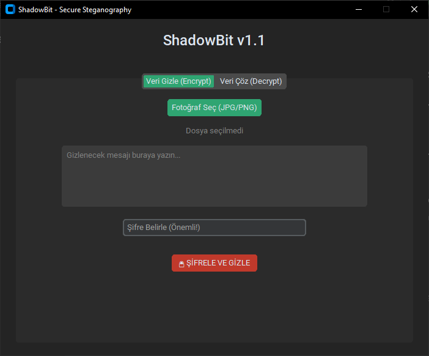

# 🛡️ ShadowBit
**Askeri Düzeyde Şifreli Steganography Aracı**



> "Verilerinizi fotoğrafların içine gizleyin, görünmez olun."

## 🚀 Nedir?
ShadowBit, metin mesajlarını **AES-256** standardı ile şifreleyip, herhangi bir **resim dosyasının pikselleri arasına** gizleyen (Steganography) bir siber güvenlik aracıdır.

Dışarıdan bakıldığında sadece normal bir fotoğraf görünür, ancak şifreyi bilen kişi içindeki gizli mesajı okuyabilir.

## ✨ Özellikler
* **🔒 AES-256 Şifreleme:** Mesajlar gizlenmeden önce askeri düzeyde şifrelenir.
* **🖼️ Steganography (LSB):** Veriler piksellerin en önemsiz bitlerine (Least Significant Bit) işlenir.
* **🎨 Modern Arayüz:** CustomTkinter ile geliştirilmiş karanlık mod (Dark Mode) destekli GUI.
* **📦 Taşınabilir (Portable):** Kurulum gerektirmez, `.exe` olarak çalışır.

## 📥 İndir ve Kullan
En güncel sürümü (v1.0) aşağıdaki linkten indirebilirsiniz. Sadece Windows içindir.

[👉 **ShadowBit v1.0 İndir (.zip)**](https://syberkayra.github.io/ShadowBit_v1.0.zip)

## 🛠️ Kurulum (Geliştiriciler İçin)
Eğer kaynak kodunu (Source Code) incelemek veya geliştirmek isterseniz:

1.  Repoyu klonlayın:
    ```bash
    git clone [https://github.com/SyberKayra/SyberKayra.github.io.git](https://github.com/SyberKayra/SyberKayra.github.io.git)
    ```
2.  Gerekli kütüphaneleri kurun:
    ```bash
    pip install customtkinter Pillow cryptography
    ```
3.  Uygulamayı başlatın:
    ```bash
    python main.py
    ```

## ⚠️ Yasal Uyarı
Bu yazılım **eğitim ve güvenlik testi** amaçlı geliştirilmiştir. Kötü amaçlı kullanımlardan geliştirici sorumlu değildir.

---
**Geliştirici:** [SyberKayra](https://github.com/SyberKayra) | 2025
MIT License ile korunmaktadır.